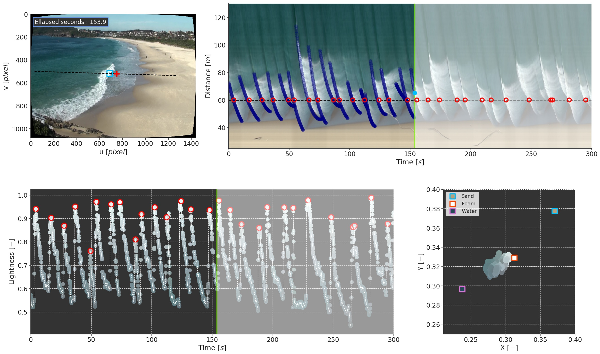

Surf Zone Wave Tracking
==================================

Authors
-------

Caio E. Springari

.. raw:: html

  <iframe width="560" height="315"
   src="https://www.youtube.com/embed/r-07ubMhTC0" frameborder="0"
   allow="accelerometer; autoplay; encrypted-media; gyroscope; picture-in-picture"
   allowfullscreen></iframe>

This animation illustrates the “color learning” procedure described in the
paper “A Novel Machine Learning Algorithm for Tracking Remotely Sensed Waves
in the Surf Zone”, recently published by Coastal Engineering. The goal of this
algorithm is to detect wave breaking in video recordings of the surf zone in
natural beaches. From frames extracted from the raw video imagery (top left
panel) a line of pixels (the dashed line) is extracted and stacked in time,
resulting in the image seen in the top right panel. This image, kwon as
time-stack, shows the waves’ propagation path through time (x-axis) and space
(y-axis). From these time-stacked pixel lines, time-series of pixel
intensities and colors are extracted at given locations (for example, at the
dashed line) resulting in the plot seen in bottom left panel. By projecting
the color information of these timeseries into an appropriated metric for
color representation (bottom right panel) and classifying the color of the
pixel intensity into three main classes (sand, water, or breaking waves) it is
possible to extract the wave breaking information. After the pixel intensity
classification step, the instances representing wave breaking are clustered to
obtain individual waves, effectively tracking the wave propagation path in the
surf zone. To verify that the algorithm worked, the learnt wave breaking
events are re-projected into the captured frames, resulting in the submitted
animation. Given that the time-stack image is ready for processing, the
computational cost of the algorithm is low, requiring less than 10 seconds to
process 5 minutes of data on a mid-range laptop. The algorithm was developed
using field data collected at several Australian beaches and, on average,
tracked 95% of the observed broken waves when compared to visual assessment.
The developed algorithm has several applications for coastal zone studies, for
example, to study wave propagation speeds in the surf zone, and to obtain
estimations of wave energy dissipation due to wave breaking.

