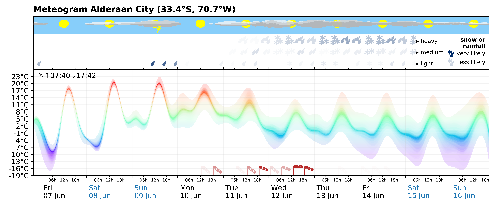

Intuitive probabilistic meteogram
=================================

Authors
-------

Milan Kloewer

A 7-day weather forecasts is now as accurate as a 5-day forecast 20 years ago,
thanks to faster supercomputers and decades of scientific weather forecast
model development. However, there is still a widespread public misbelief that
forecasts are not reliable. Traditional weather forecasts rarely contain
information about the reliability and a paradigm exists where a layperson is
not expected to understand forecast uncertainty. Especially smartphone weather
apps tend to present forecasts in an overly simplistic way that may support
the aforementioned little public confidence in weather forecasting.

The proposed solution is an intuitive way of visualizing the probabilistic
information of an ensemble forecast in the form of a meteogram, summarizing
the weather for a given location throughout the next week, as this is of large
public interested. The meteogram is designed to be easily understandable for
everyone without a statistics background. The temperature is plotted as a
colour-shaded time series, where width and transparency denote the uncertainty
and colour is used to provide an intuitive feeling for the temperature
(blue=cold, red=warm). Strong winds can be seen on the bottom of that panel,
where a windsock indicates the expected strength. Transparency denotes the
uncertainty of the wind forecast. The upper panels provide information about
cloudiness and precipitation. Rain and snow are split into three categories:
light, medium and heavy that are displayed in three rows, each with
transparency to denote the uncertainty of a rainfall event at a given
strength. In case of snow, the rain droplets are changed into snow flakes. The
precipitation panel therefore can display events like "very likely weak rain,
but unlikely stronger" or "equally likely medium or heavy rain". Cloudiness is
presented in the top panel, indicating clouds at low, medium and high
altitudes in different shades of grey. The thickness represents the cloud
cover of each level. Additionally, a lightning bolt may indicate once the
chance of thunder is beyond a given threshold. Sunrise and sunset times are
provided in the temperature panel.

The weather forecast for Alderaan City shows warm temperatures during the day
around 20°C for the next days, although nights are cold. Weak rain and thunder
has to be expected on Sunday. Monday will be the most beautiful day of the
week with low cloud cover and temperatures around 14°C. During the week,
temperatures are expected to drop and uncertainty increases towards the next
weekend. Strong winds have to be expected for Monday, Tuesday and Wednesday,
that will peak on Wednesday noon. Probably strong rainfall from Tue onwards,
increasing in likelihood and strength towards Thursday and Friday. Full cloud
cover throughout the week, but thinner on the next weekend.

We believe that the additional information about the uncertainty of a forecast
will increase public confidence in weather forecasting, important for a wider
outreach of publicly funded data.

---

Notes on data used: Due to licensing and size issues, we cannot provide the
ensemble prediction data from the European Centre for Medium-Range Weather
Forecasts (ECMWF, Reading, UK) directly. However, many meteogram examples of
current forecasts can be found in the repository
(github.com/milankl/prob_meteogram/examples). In order to present a meteogram
that contains all features (wind, extreme temperatures, rain, snow, thunder,
clear sky as well as clouds) within a single week, we have faked data for a
fake location, that is available in the repository.

