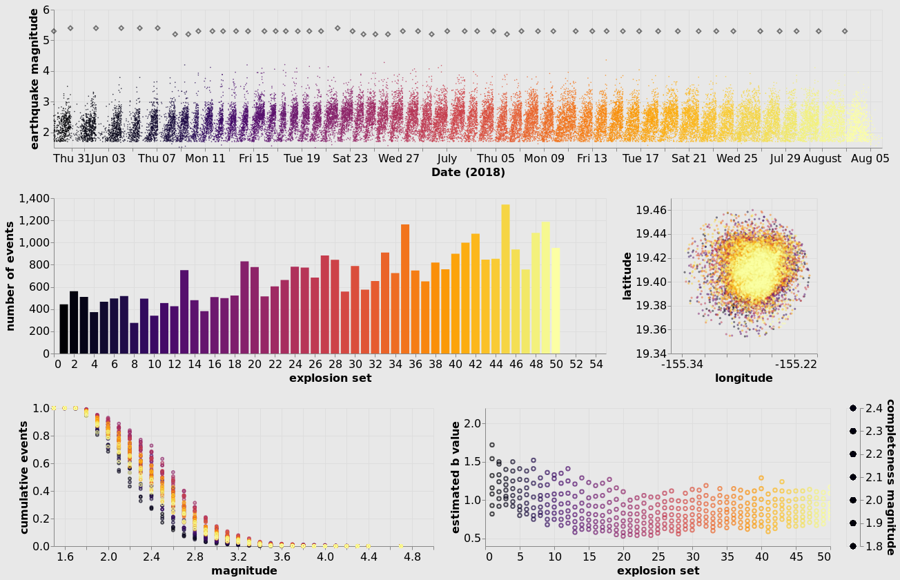

Kilauea summit earthquakes: May - August 2018
========================================================

Author
------

Nicole Hoffman

.. raw:: html

   <iframe width="560" height="315"
   src="https://www.youtube.com/embed/bvDIiRIruAs" frameborder="0"
   allow="accelerometer; autoplay; encrypted-media; gyroscope; picture-in-picture"
   allowfullscreen></iframe>

The 2018 eruption of the lower East Rift Zone (LERZ) of Kilauea volcano in
Hawaii was the largest in over 200 years. While the volcano had active vents
since 1983, changes began to occur in March 2018 which indicated new patterns
of magma movement and the possibility of a more significant eruption in the
near future. Increasing seismicity in the LERZ combined with ground
deformation was followed by LERZ eruptive fissures opening in early May. 

At the summit, magma was draining from the shallow subsurface reservoir,
removing the support for the caldera rocks above. As magma continued to drain,
the rate of summit earthquakes increased and an interesting pattern emerged:
increasing earthquake rate (mostly < M4) followed by a larger magnitude
collapse event (~M5), and then an abrupt decrease in the earthquake rate.
After a few hours with very few earthquakes, the process would begin again. A
total of 62 collapse events occurred between early May and August 2018, after
which the eruption ceased.

The pattern of earthquakes and collapse events became remarkably consistent
near the end of May. This visualization focuses on the summit earthquakes and
explosive events from May 29 to August 3. Using the explosive event times
starting May 29, the summit earthquakes were placed into “sets”, allowing the
comparison of the properties of each set and how they change during the
eruption. 

Each plot is intended to visualize a different aspect of the summit earthquake
sets. The top scatter plot shows an overview of all of the earthquakes
(colored dots) and explosive events (diamonds) over time. When hovering over
each explosive event, the magnitude and depth is displayed.

The center left plot is a histogram of the number of events in each set. Individual or multiple sets can be selected (hold down the shift-key) and those selections are linked to the other plots, highlighting the selected set(s). To the right of the histogram is a scatter plot of the spatial distribution of the earthquakes (the circular shape results from an initial selection of earthquakes in a 6 km radius circular region centered on the summit).

The bottom left plot is the frequency-magnitude diagram (FMD) for each set (a
cumulative sum of events at each magnitude; the smallest magnitude contains
the total number of events). When a set(s) is selected in the histogram, the
corresponding FMD(s) is displayed.
 
The bottom right plot shows the estimated b-value for the Gutenberg-Richter
distribution given by: log N = a-bM, where N is the total number of
earthquakes greater than magnitude M, the a-value is the total seismicity, and
the b-value is the proportion of large to small earthquakes. The b-value was
estimated for a range of completeness magnitudes (Mc 1.8-2.4). Using the
interactive legend on the right, a completeness magnitude(s) can be selected
to show how this affects the estimated b-value.

