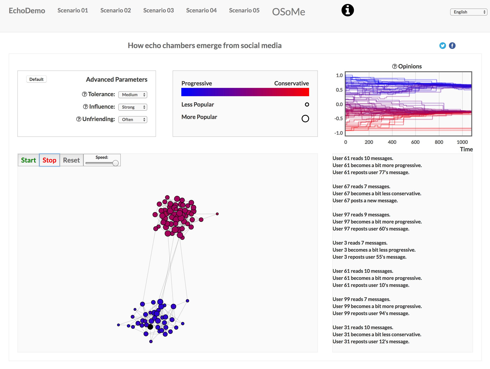

How echo chambers emerge from social media
====================================================

Authors
-------

Hao Peng

.. raw:: html

  <iframe width="560" height="315"
   src="https://www.youtube.com/embed/siPhc17u5Sw" frameborder="0"
   allow="accelerometer; autoplay; encrypted-media; gyroscope; picture-in-picture"
   allowfullscreen></iframe>

This is an interactive demo illustrating how two basic mechanisms of social
media --- influencing friends opinion and unfriending people with different
ideas --- can lead to polarized and segregated social networks, which is
detrimental to social harmony and the wisdom of the crowd. Each node in the
network represents a user. Its size represents user's popularity (number of
friends) and its color represents user's political opinion. The demo runs
agent-based simulations with three parameters. It allows users to monitor the
network dynamics and track the opinion evolution with different model
configurations. A snapshot of the final state is provided for several
parameter settings. This visualization can be used to warn the public about
the danger of social media as it facilitates the emergence of online echo
chambers.

