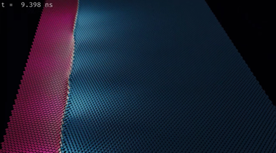

Domain Wall Motion in a Disordered Magnetic Film
===========================================================

Authors
--------

Peyton Murray

.. raw:: html

  <iframe width="560" height="315" src="https://www.youtube.com/embed/mE16ebcTSIY" frameborder="0" allow="accelerometer; autoplay; clipboard-write; encrypted-media; gyroscope; picture-in-picture" allowfullscreen></iframe>

On nanometer length scales, ferromagnetic materials are made up of microscopic magnetic moments, with each moment producing its own magnetic field. When a large number of moments align to form domains of parallel magnetization, a macroscopic field is produced which is readily observed in the attraction (and repulsion) between everyday bar magnets. This phenomenon, known as ferromagnetism, has wide ranging technological applications, with ferromagnetic materials playing central roles in electric motors, data storage, and sensors. Understanding the behavior of these materials on the microscopic level is therefore critical for next-generation device applications.

While the dynamical behavior of magnetic moments has been a topic of interest for more than 50 years, more recently the boundaries between magnetic domains, known as domain walls, have also attracted attention. This animation focuses on one such domain wall, and depicts the simulated motion of moments in a layer of disordered magnetic material 0.5 nm thick and 512x1024 nm^2 in area. The film was intialized with moments along the left side of the film pointing along -z, and those along the right side pointing along +z. A magnetic field of H = 100 Oe was applied along -z, and the system was allowed to evolve in time according to the Landau-Lifshitz-Gilbert (LLG) equation, with periodic boundary conditions applied in the y-direction. Integration of the LLG equation was carried out using a finite differences scheme with the open source Mumax3 micromagnetic solver. Realistic material parameters were chosen for the simulation based on work done as part of a study of domain wall motion in disordered media carried out at Tampere University. Additional details of the micromagnetic parameters used for the simulation can be found in the repository for this project.

As the system evolves, the downward-pointing domain grows at the expense of the other domain. As the simulation ends, the upward-pointing domain is annihilated, with all moments in the system pointing downwards. The motions of individual moments highlight how complicated the dynamics of magnetic systems can be, and gives a unique look at the microscopic behavior of these materials.

After simulating the motion of the magnetic material using Mumax, the output data was loaded into Blender, an open source suite of 3D rendering and animation tools. Blender's Python API was used to load the location and orientation of each magnetic moment at each simulation step. A subset of magnetic moments from the simulation were represented with cones in the final animation, with the orientation vector for each magnetic moment determining the direction of each cone. Matplotlib's RdBu_r colormap was used to color the z-component of the magnetization, with -z (down) mapped to red, and +z (up) mapped to blue. Finally, an introductory animation was added before the simulation animation, and explanatory text was overlaid on top. Blender's Cycles render engine was used to add high-fidelity lighting and camera motion.

