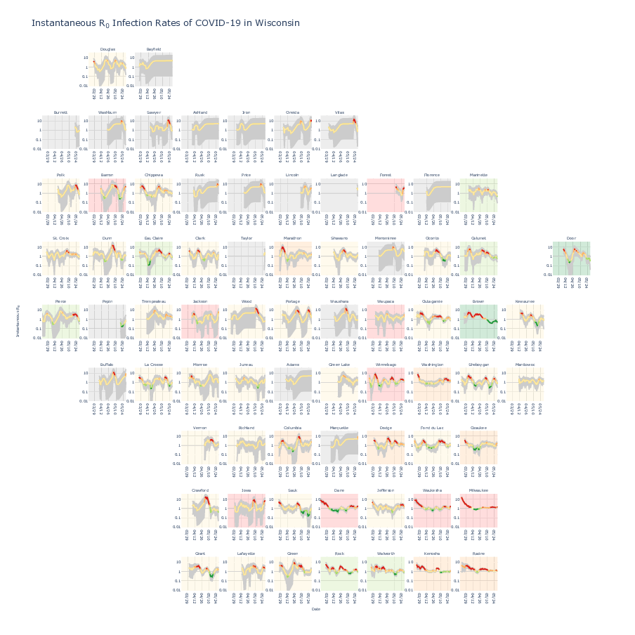

Entry 53: Temporally-dynamic instantaneous R0 spatially-resolved by Wisconsin counties using geofacetting
==========================================================================================================

The spread of the COVID-19 and the rise in death toll come as political leaders seek to reopen parts of the country. Given that COVID-19 affects the health and well-being of all residents, local and state officials need information about the extent and impact of COVID-19. Governments increasingly use R0 as a metric for whether the number of cases is growing faster than they can manage or reducing as quickly as they would like. R0 represents the number of new infections estimated to originate from a single case. An R0 below 1 implies the number of cases is reducing, permitting communities to open back up, while an R0 above 1 implies necessitating renewed lockdowns or other measures. The metric describes a snapshot of how the virus is spreading at a given time and place. Therefore, visualizing R0 spatially and temporally is necessary to accurately and effectively report the metric.

Currently, most COVID-19 visualizations suffer from (1) overplotting, (2) lack of uncertainty component, (3) inability to provide both spatial and temporal context, or (4) inability to compare between different entities at different times. Thus, geofacetting is an intuitive approach to summarize R0 spatially and temporally for all Wisconsin counties over all time points. It preserves the geographical orientation of the entities and maintains the time dependence of the metric. The method plots multiple variables per entity, namely time-series data of R0 per county to prevent overplotting observed in line plots. It uses more effective visual encoding schemes than just color observed in choropleth maps. Each entity is given equal plot area to help health system officials weigh counties equally and determine geographic hot spots. Hovering over data points provides details-on-demand including the county name, date, number of cases, mean R0, and 95% CI. The semantic mapping of color encodes "risk" where the line and tooltip are red if the number of cases increases fast, yellow if it stays the same or increases slowly, and green if it decreases. Similarly, the plot area encodes "risk" using the current mean R0. The line is the mean R0 and the gray area is the 95% CI or the uncertainty. The horizontal lines denote the boundaries for risk. Also, the user can modify the plots using the zoom, pan, and scale features to a specific view, necessary for reporting.

The interactive at the time of May 29, 2020 shows low-case counts for counties in the north and low-risk counties in the northeast, and low to high-risk counties in the east and northwest to southwest areas of the state. For example, Dane County can be easily identified as high risk. The R0 is above 1.2 and increasing in trend. The neighboring high-case count counties are either low-medium or low-high risk or decreasing in trend. Health system officials can increase hospital resources to meet local needs diverting it from neighboring lower risk areas. Currently, multiple health systems including Gundersen Health, Marshfield Clinic, and the Wisconsin Department of Health Services use this visualization to anticipate trends and alert health professionals a few critical days in advance.

Please see https://github.com/aravamu2/jhepc/blob/master/results/instantaneous_r0_plotly.html for interactive.

