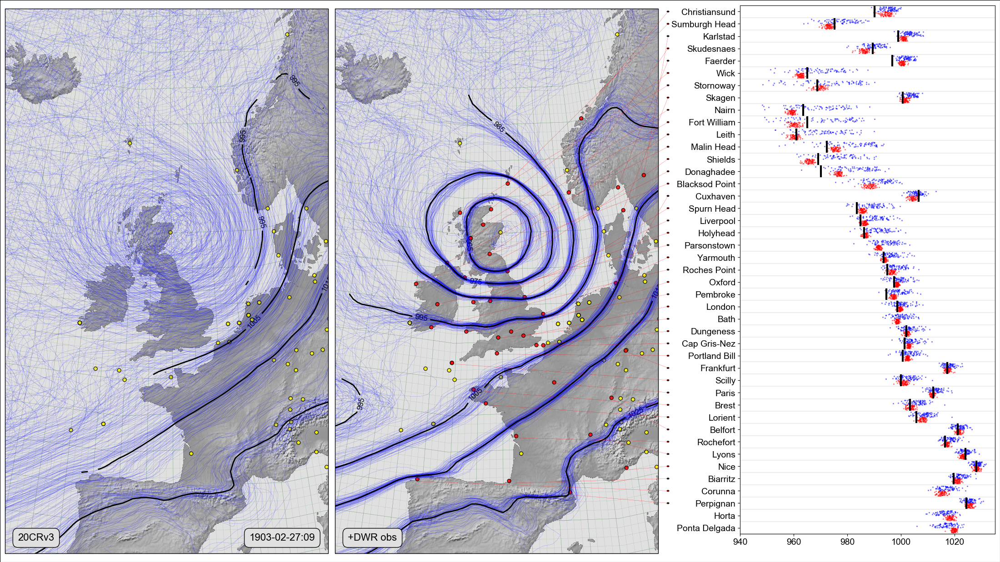

Weather rescue: The Ulysses storm of 1903
===================================================

Authors
-------

Philip Brohan

Estimating the impacts and effects of climate change is not just about predicting the future - we also need to reconstruct past weather: to provide context for the predictions, and validation for our models. Such reconstructions depend critically on historical records - in times and places where our databases contain many observations our reconstructions can be good, in other places they are very uncertain. So we have an international research program (http://met-acre.net/) to improve our reconstructions.

This visualization shows the effect, on a climate reconstruction, of a project to rescue archived historical records - the Weather Rescue project (https://www.zooniverse.org/projects/edh/weather-rescue/). The two left-hand panels show weather maps of a severe weather event - the Ulysses storm of 1903. They are spaghetti-contour plots of sea-level pressure, each shows an ensemble of 80 reconstructions (the thin blue lines), and an ensemble-mean consensus (black lines) where the uncertainty is small. The reconstructions are from the Twentieth Century Reanalysis (https://www.psl.noaa.gov/data/20thC_Rean/).

The circles mark the historic observations used in the reconstruction - yellow circles are observations used by both reconstructions, red circles mark newly-recovered observations from Weather rescue. The right hand panel is a validation of the reconstructions against the newly-rescued observations. For each location with new observations, observations are in black, blue dots show the ensemble members from the reconstruction with just the original observations, red dots show members from a reconstruction  also using all the new observations except the one at the location being compared.

Historical data rescue is a critical component of climate science - by rescuing past observations from the archives, we can make big improvements in our estimates of climate change and variability.

Also available as a video version: https://player.vimeo.com/video/297919245

